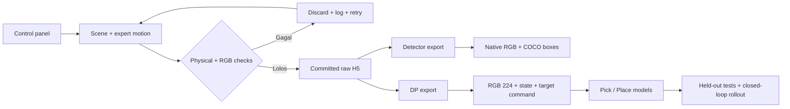
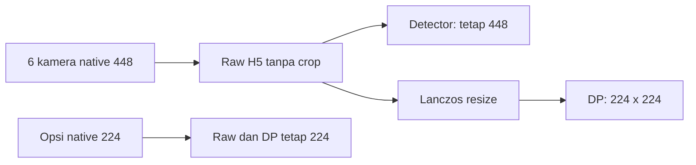
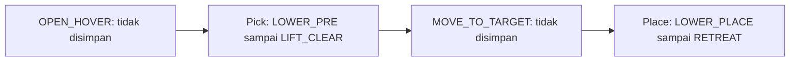

# Surgical Instrument Pick & Place

IsaacLab recorder untuk lima instrumen, dataset detector terpisah, dan Diffusion Policy (DP).

[Recorder](docs/RECORDER.md) · [Training](training/README.md) · [Inference](docs/INFERENCE.md) · [Debug](debug/README.md) · [Branch workflow](docs/BRANCHES.md)

## Pipeline



**Record bukan train. Export berhasil bukan bukti model sudah akurat.**

## Buka control panel

Ganti placeholder dengan lokasi checkout, lalu jalankan dari root proyek.

```powershell
cd "<PROJECT_DIRECTORY>"
.\RUNME.ps1 -Mode check
.\RUNME.ps1 -Mode panel
```

| Pengaturan | Untuk koleksi baru | Arti |
| --- | --- | --- |
| Save skill | `both` | Simpan Pick dan Place |
| Dataset purpose | `Both: DP + detector (recommended)` | Satu raw recording, dua tujuan export |
| Recorded image size | `448` | Detail sumber lebih banyak; DP tetap 224 |
| Save raw to | Folder baru | Jangan campur kalibrasi/resolusi lama |
| Distractors | Rentang yang dipilih | Target unik; duplikat tambahan hanya di meja |
| Tray | Random / full / manual | Isi awal pada slot tetap |

Mulai beberapa episode, periksa enam kamera dan **hasil export DP 224**, baru lanjut koleksi besar.

## Kamera: raw dan input model



| Kamera | RGB di H5 | Fungsi |
| --- | --- | --- |
| Front | `observations/front_rgb` | Area kerja utama |
| Wrist / grip | `observations/wrist_rgb` | Detail dekat gripper |
| Top | `observations/cam_top_rgb` | Konteks atas meja |
| Left | `observations/cam_left_rgb` | Sudut kiri |
| Right | `observations/cam_right_rgb` | Sudut kanan |
| Tray | `observations/cam_tray_rgb` | Area tray |

Preview PNG berisi sampel frame; H5 menyimpan semua frame dalam segmen terpilih.
448 + FXAA membantu sampling dan tepi, tetapi tidak menjamin objek kecil tetap jelas pada input akhir 224.
Resume memakai layout kamera sesi asli; gunakan sesi baru untuk framing baru.

## Segmen policy



| Segmen | Stage yang disimpan |
| --- | --- |
| Pick | LOWER_PRE, LOWER_GRASP, LOWER_EXTRA jika perlu, CLOSE, LIFT_CLEAR |
| Place | LOWER_PLACE, OPEN, RETREAT |
| Persiapan / transfer | Tetap dijalankan controller, bukan data policy |

## Pilih workflow

| Tujuan | Panduan | Hasil |
| --- | --- | --- |
| Record / resume | [Recorder](docs/RECORDER.md) | H5, commit, coverage |
| Export / train | [Training](training/README.md) | Dataset dan checkpoint |
| Jalankan model | [Inference](docs/INFERENCE.md) | Prediksi aksi; perlu integrasi controller |
| Cari masalah | [Debug](debug/README.md) | Log, audit, failure preview |
| Pahami modul | [Source](src/README.md) / [Environment](env/README.md) | Dependency dan konfigurasi |

## Status kualitas

| Pemeriksaan | Sudah diketahui | Belum membuktikan |
| --- | --- | --- |
| H5 / commit / resume | Ada checksum dan consistency checks | Semua attempt sukses |
| Enam kamera / front baru | Preview scene dan tes proyeksi diperiksa | Semua objek terlihat saat robot bergerak |
| Data lama 224 | Sampel target front terlalu kecil | Semua dataset pasti buruk |
| Export DP 224 | Jalur resize diuji | Kualitas visual seluruh koleksi disetujui |
| Training smoke | Jalur komputasi berjalan | Akurasi atau sukses manipulasi |

Detail bukti: [kontrak training v2](docs/TRAINING_V2.md). Belum ada klaim siap deployment.

## Struktur dan publikasi

| Lokasi | Isi |
| --- | --- |
| `src/`, `backends/`, `env/` | Recorder, panel, konfigurasi |
| `training/` | Export, model, runtime |
| `scripts/`, `tests/` | CLI, audit, regression tests |
| `assets/` | Dependensi scene/instrumen |
| `docs/` | Panduan dan bukti historis |
| `datasets/`, `debug/`, `training/runs/` | Output lokal; bukan source untuk GitHub |

Root compatibility shims masih dipakai, bukan duplikat yang aman dihapus.
Raw H5, checkpoint, log dan credential tidak boleh dipublish. Jalankan `python scripts/check_publish.py`; scanner bukan jaminan bebas rahasia.

**Branch integrasi: `angel/main`.** Kerjakan perubahan di branch fungsi yang sesuai,
lalu review sebelum merge. `main` lama disimpan sebagai snapshot cadangan;
`jordan` mempunyai riwayat terpisah. Lihat [branch workflow](docs/BRANCHES.md).
