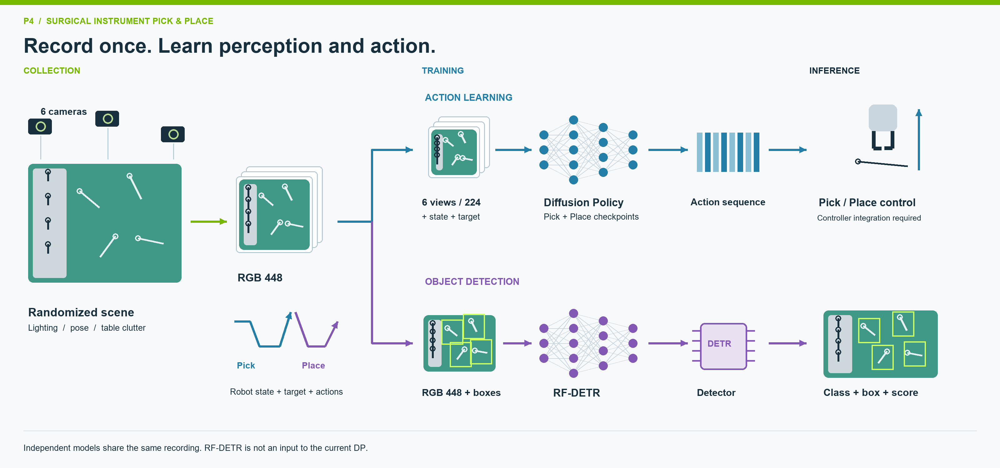
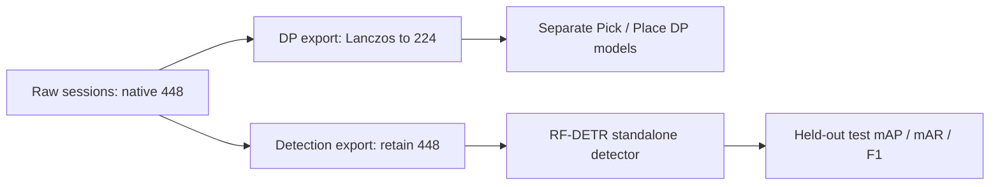
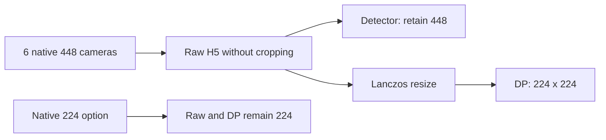
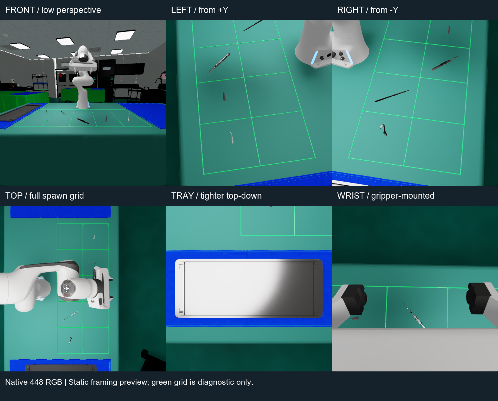
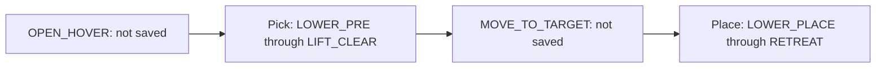

# Surgical Instrument Pick & Place

An IsaacLab recorder for five surgical instruments, standalone detector datasets, and Diffusion Policy (DP).

[Recorder](docs/RECORDER.md) · [Training](training/README.md) · [Inference](docs/INFERENCE.md) · [Branch workflow](docs/BRANCHES.md)

## Pipeline



One recording feeds Pick DP, Place DP, and a standalone RF-DETR detector.
RF-DETR is not an input to the current DP implementation.

**Recording is not training. A successful export does not prove model accuracy.**

## Open the control panel

Replace the placeholder with your checkout location and run from the project root.

```powershell
cd "<PROJECT_DIRECTORY>"
.\RUNME.ps1 -Mode panel
```

| Setting | New collection | Meaning |
| --- | --- | --- |
| Save skill | `both` | Save Pick and Place segments |
| Dataset purpose | `Both: DP + detector (recommended)` | One raw recording, two export targets |
| Recorded image size | `448` | More source detail; DP input remains 224 |
| Save raw to | New folder | Do not mix older calibration or resolution |
| Distractors | Selected range | One target; extra duplicates appear only on the table |
| Tray | Random / full / manual | Initial occupants use fixed slots |

Start with a few episodes. Inspect all six cameras and the **exported DP 224 images** before collecting at scale.

## After recording: DP + RF-DETR

Choose **Both: DP + detector** and **448** in the panel. The same raw sessions are exported into two independent training inputs; this does not merge the two models.



```powershell
# 1. Export both products after train, valid, and test sessions are complete.
.\RUNME.ps1 -Mode export -Source "<RAW_COLLECTION>" -Output "<NEW_EXPORT_DIRECTORY>"

# 2. Install RF-DETR once in an isolated Python 3.11 environment.
.\RUNME.ps1 -Mode rfdetr-setup

# 3. Refuse malformed, non-448, or incomplete detector data.
.\RUNME.ps1 -Mode rfdetr-check -Dataset "<NEW_EXPORT_DIRECTORY>\detection"

# 4. Train RF-DETR Small, then evaluate the held-out test split.
.\RUNME.ps1 -Mode rfdetr-train `
  -Dataset "<NEW_EXPORT_DIRECTORY>\detection" `
  -Output "<NEW_RFDETR_RUN_DIRECTORY>" `
  -RFDetrModel small -Epochs 50 -BatchSize 4 -GradAccumSteps 4
```

The final checkpoint is `<NEW_RFDETR_RUN_DIRECTORY>\checkpoint_best_total.pth`; held-out results are saved in `p4_rfdetr_result.json`. Full instructions and GPU notes are in [Training](training/README.md).

## Cameras: raw recordings and model inputs



| Camera | RGB dataset in H5 | Purpose |
| --- | --- | --- |
| Front | `observations/front_rgb` | Low frontal perspective covering the entire spawn grid |
| Wrist / grip | `observations/wrist_rgb` | Moving close-up of the grasp and nearby instruments |
| Top | `observations/cam_top_rgb` | Vertical overview covering the entire spawn grid |
| Left | `observations/cam_left_rgb` | Oblique view from the positive-Y side, focused on upper spawn cells |
| Right | `observations/cam_right_rgb` | Oblique view from the negative-Y side, focused on lower spawn cells |
| Tray | `observations/cam_tray_rgb` | Tight vertical close-up of the complete tray |

Front is positioned at `(1.10, -0.1924, 0.32)` m in the scene frame, with a
13-degree downward angle inspired by the low Perspective viewport reference.
Its square view retains the full spawn grid and lift envelope; it is not an
exact copy of a landscape viewport. Background and robot occlusions may remain.
Raw frames remain 448 × 448;
DP export remains 224 × 224.



Recorders save sensor frames in H5, without automatic episode, failure, or scene-audit PNGs.
Existing previews are not deleted. Restart the recorder process to use this behavior.

To create images on demand: **Control panel → Files & export → Export PNG previews from folder...**
Choose a source run/collection, filter **Pick / Place / Both**, and select the episode
files to inspect. Use **Middle frame** for a quick check, First/Last, or all frames with
an interval (`1` = every frame). Then choose a separate destination. All available cameras are exported at their
stored resolution, without cropping or resizing. RGB PNGs preserve recorded pixels;
semantic PNGs include both raw class IDs and a separate `semantic_color` visualization
using H5 class metadata; `semantic_legend.json` records the colors. Depth PNGs are 0–2 m
display previews, not metric training data. No GIFs or videos are generated.
The source H5 files remain unchanged; failed-attempt images cannot be recovered from
H5 because failed trajectories are not saved. Failure evidence JSON remains available.
448 + FXAA improves sampling and edges, but does not guarantee that small objects remain clear at the final 224 resolution.
Resume preserves the original session's camera layout; start a new session to use new framing.
Front, left, and right retain distinct oblique viewing directions. Front and top
each cover the entire spawn grid, including a 2 cm XY margin through 18 cm above
the table. Left/right provide overlapping closer side views. Tray has
its own tighter vertical view. A long rectangular work area cannot fill a square
image in both axes, so some surrounding table remains visible. Robot parts can still
cross a spawn view during manipulation because the arm physically operates above
the target; the complete robot is not the subject of any static view.

## Policy segments



| Segment | Saved stages |
| --- | --- |
| Pick | LOWER_PRE, LOWER_GRASP, optional LOWER_EXTRA, CLOSE, LIFT_CLEAR |
| Place | LOWER_PLACE, OPEN, RETREAT |
| Preparation / transfer | Still executed by the controller, excluded from policy data |

## Choose a workflow

| Goal | Guide | Output |
| --- | --- | --- |
| Record / resume | [Recorder](docs/RECORDER.md) | H5, commits, coverage |
| Export / train | [Training](training/README.md) | Datasets and checkpoints |
| Run a model | [Inference](docs/INFERENCE.md) | Action predictions; controller integration required |
| Understand the modules | [Source](src/README.md) / [Environment](env/README.md) | Dependencies and configuration |

Runtime validation remains enabled. Recording success does not establish model
accuracy or deployment readiness; see the training and inference guides.

## Structure and publication

| Location | Contents |
| --- | --- |
| `src/`, `backends/`, `env/` | Recorder, panel, configuration |
| `training/` | Exporters, models, runtime |
| `scripts/`, `tests/` | CLI, maintained utilities, regression tests |
| `assets/` | Scene and instrument dependencies |
| `docs/` | Usage guides and pipeline illustration |
| `compat/` | Legacy flat import names; canonical code remains in the folders above |
| `datasets/`, `debug/`, `training/runs/` | Local output, not source for GitHub |

The root now contains only public launch and repository files. Compatibility
shims are grouped under `compat/`; edit the canonical source instead.
Do not publish raw H5, checkpoints, logs, or credentials. Run `python scripts/check_publish.py`; the scanner cannot guarantee that all secrets are detected.

**Integration branch: `angel/main`.** Develop changes on the appropriate functional branch and review them before merging.
The legacy `main` retains the pre-reorganization code baseline; documentation may receive maintenance updates.
`jordan` has independent history. See the [branch workflow](docs/BRANCHES.md).
