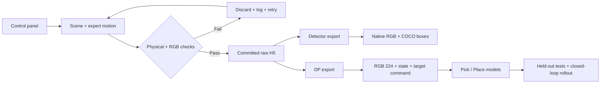
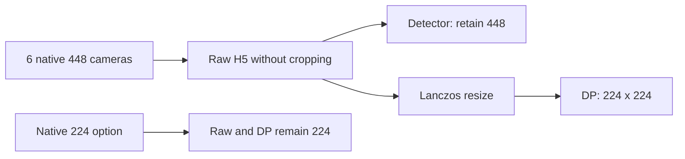
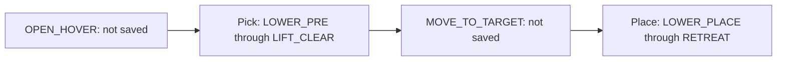

# Surgical Instrument Pick & Place

An IsaacLab recorder for five surgical instruments, standalone detector datasets, and Diffusion Policy (DP).

[Recorder](docs/RECORDER.md) · [Training](training/README.md) · [Inference](docs/INFERENCE.md) · [Debug](debug/README.md) · [Branch workflow](docs/BRANCHES.md)

## Pipeline



**Recording is not training. A successful export does not prove model accuracy.**

## Open the control panel

Replace the placeholder with your checkout location and run from the project root.

```powershell
cd "<PROJECT_DIRECTORY>"
.\RUNME.ps1 -Mode check
.\RUNME.ps1 -Mode panel
```

| Setting | New collection | Meaning |
| --- | --- | --- |
| Save skill | `both` | Save Pick and Place segments |
| Dataset purpose | `Both: DP + detector (recommended)` | One raw recording, two export targets |
| Recorded image size | `448` | More source detail; DP input remains 224 |
| Save raw to | New folder | Do not mix older calibration or resolution |
| Distractors | Selected range | One target; extra duplicates appear only on the table |
| Tray | Random / full / manual | Initial occupants use fixed slots |

Start with a few episodes. Inspect all six cameras and the **exported DP 224 images** before collecting at scale.

## Cameras: raw recordings and model inputs



| Camera | RGB dataset in H5 | Purpose |
| --- | --- | --- |
| Front | `observations/front_rgb` | Main work area |
| Wrist / grip | `observations/wrist_rgb` | Detail near the gripper |
| Top | `observations/cam_top_rgb` | Overhead table context |
| Left | `observations/cam_left_rgb` | Left-side view |
| Right | `observations/cam_right_rgb` | Right-side view |
| Tray | `observations/cam_tray_rgb` | Tray area |

PNG previews contain sampled frames; H5 stores every frame within the selected segments.
448 + FXAA improves sampling and edges, but does not guarantee that small objects remain clear at the final 224 resolution.
Resume preserves the original session's camera layout; start a new session to use new framing.

## Policy segments



| Segment | Saved stages |
| --- | --- |
| Pick | LOWER_PRE, LOWER_GRASP, optional LOWER_EXTRA, CLOSE, LIFT_CLEAR |
| Place | LOWER_PLACE, OPEN, RETREAT |
| Preparation / transfer | Still executed by the controller, excluded from policy data |

## Choose a workflow

| Goal | Guide | Output |
| --- | --- | --- |
| Record / resume | [Recorder](docs/RECORDER.md) | H5, commits, coverage |
| Export / train | [Training](training/README.md) | Datasets and checkpoints |
| Run a model | [Inference](docs/INFERENCE.md) | Action predictions; controller integration required |
| Investigate a problem | [Debug](debug/README.md) | Logs, audits, failure previews |
| Understand the modules | [Source](src/README.md) / [Environment](env/README.md) | Dependencies and configuration |

## Quality status

| Check | What is established | What it does not establish |
| --- | --- | --- |
| H5 / commit / resume | Checksum and consistency checks are implemented | Every attempt succeeds |
| Six cameras / new front view | Scene previews and projection tests were inspected | Every object stays visible during robot motion |
| Older 224 data | Sampled front-view targets were too small | Every dataset is unusable |
| DP 224 export | The resize path is tested | The entire collection has passed visual review |
| Training smoke test | The computation path executes | Recognition accuracy or manipulation success |

Evidence: [training v2 contract](docs/TRAINING_V2.md). Deployment readiness has not been established.

## Structure and publication

| Location | Contents |
| --- | --- |
| `src/`, `backends/`, `env/` | Recorder, panel, configuration |
| `training/` | Exporters, models, runtime |
| `scripts/`, `tests/` | CLI, audits, regression tests |
| `assets/` | Scene and instrument dependencies |
| `docs/` | Guides and historical evidence |
| `datasets/`, `debug/`, `training/runs/` | Local output, not source for GitHub |

Root compatibility shims are still used; they are not disposable duplicates.
Do not publish raw H5, checkpoints, logs, or credentials. Run `python scripts/check_publish.py`; the scanner cannot guarantee that all secrets are detected.

**Integration branch: `angel/main`.** Develop changes on the appropriate functional branch and review them before merging.
The legacy `main` retains the pre-reorganization code baseline; documentation may receive maintenance updates.
`jordan` has independent history. See the [branch workflow](docs/BRANCHES.md).
