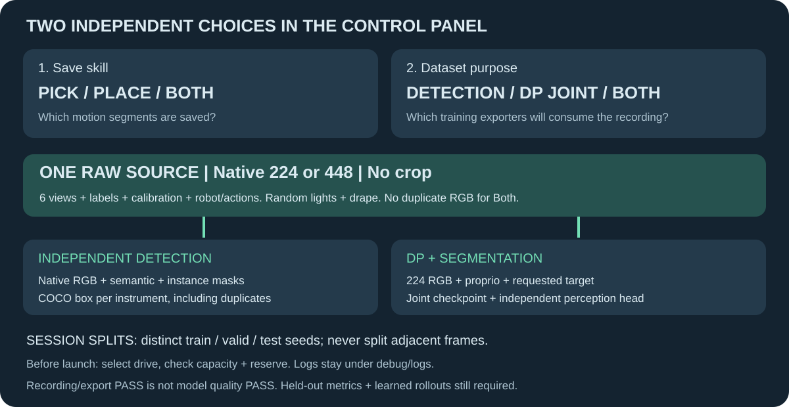
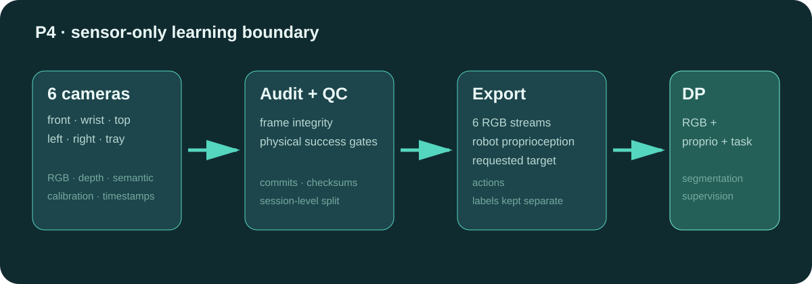
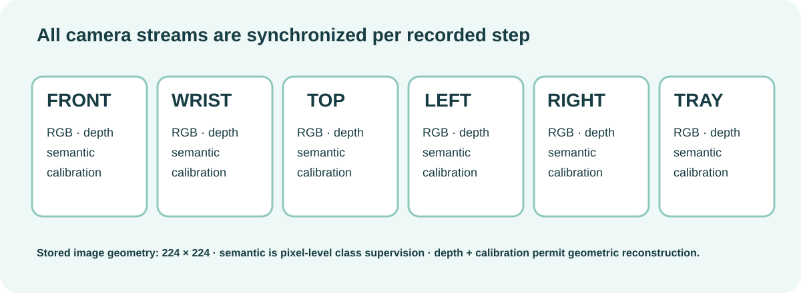
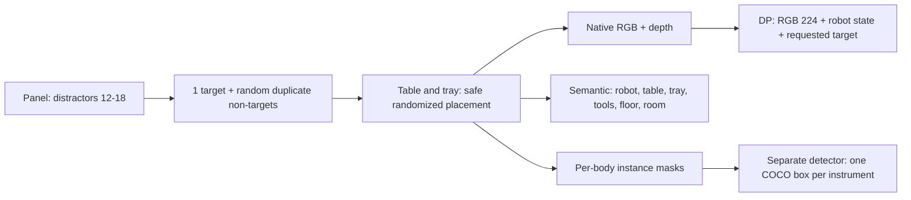
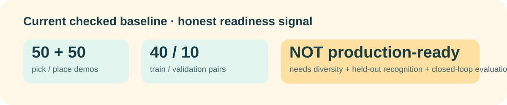

# P4 · Surgical Instrument Recording & Sensor-Only DP

Native-camera and independent-detector workflow: [training v2](docs/TRAINING_V2.md).

<p align="center"></p>

## Control panel

`1. Record & live log`: choose **Pick / Place / Both**, instrument and spawn mode.
`2. Dataset & tray`: choose **Both: DP + detector (recommended)**, recorded image size and save folder. Split and seed are automatic.
`3. Files & export`: export a completed collection with independent train, valid and test sessions. Recording does not train a model.

Both shares raw data once. All dataset modes support randomized duplicate distractors on the table and tray; the target type appears exactly once. Failed attempts never become training samples. Console details go to `debug/logs/`.

<p align="center"></p>
<p align="center"></p>

## Run

> Replace every `<PLACEHOLDER>` before running it. Do not copy the angle brackets literally.

```powershell
.\RUNME.ps1 -Mode check
.\RUNME.ps1 -Mode objects
.\RUNME.ps1 -Mode record-dry-run -Object <OBJECT_NAME>
.\RUNME.ps1 -Mode panel
.\RUNME.ps1 -Mode validate -RunDirectory <RUN_DIRECTORY>
.\RUNME.ps1 -Mode export -Source <COMPLETED_RUN_DIRECTORY> -Output <NEW_DATASET_DIRECTORY>
.\RUNME.ps1 -Mode train-smoke -Dataset <EXPORTED_DATASET_DIRECTORY> -Skill <pick|place>
```

## What is recorded

| Six synchronized views | Per-view supervision | Robot / task evidence | DP uses |
| --- | --- | --- | --- |
| front · wrist · top · left · right · tray | RGB · depth · semantic + instance masks · camera calibration | 16-D robot proprioception · 8-D action · success/physical gates · episode commit | RGB + proprioception + requested target; learns robot-base actions |

Simulator object pose, grid cell, target slot, teacher grasp, stage ID, automatic class ID, depth and semantic GT are not policy inputs. Semantic masks are separate labels for the recognition head.

DP additionally receives the operator's requested instrument type (the panel's
Target selection). At inference select it with `policy.set_target('scissor')`.
This makes the intended pick explicit when several instruments are on the table.

## Dataset gate



The target type appears once. Repeated distractor types may appear on both table
and tray. The drape stays green with seeded shade/roughness variation. See the
[capture and label contract](docs/TRAINING_V2.md) for limits and verification.

<p align="center"></p>

The checked `baseline_v11` export contains **50 pick + 50 place** demos, split 40/10 by episode. It is valid for export/training smoke tests, not a production detector or deployable DP policy: it still needs independent sessions, lighting, occlusions, within-cell jitter, held-out class IoU, and closed-loop learned-policy evaluation.

New capture supports randomized episode lighting, drape appearance, auto XY/yaw and automatic 70/20/10 session splits. The default shared-raw plan has 200 pairs across five target classes and checks storage before starting. This is a collection budget, **not a quality guarantee**; physical scale stays fixed and learned-policy validation remains required.

Windows recorder completion uses checksum-gated process exit to avoid a reproduced native USD cleanup crash. It does not convert arbitrary crashes to success. Details: [training contract](docs/TRAINING_V2.md).

## Repository boundary

Source, configurations, tests and visual docs go to GitHub. Raw H5 recordings, exports, logs, checkpoints and debug output stay local and are ignored.
Run `python scripts/check_publish.py` before publishing. Credentials remain excluded even in a private repository; the scanner is a heuristic, not a guarantee.

## Layout

| Folder | Role |
| --- | --- |
| `src/` | active recorder, runtime, UI |
| `backends/` | instrument-specific expert recorders |
| `env/` | scene and camera configuration |
| `training/` | sensor-only exporter, model, runtime |
| `tests/` | contract and regression tests |
| `scripts/` | stable CLI and inspection tools |
| `debug/`, `datasets/` | local only; ignored by Git |

Detailed operational evidence remains under `docs/`; this is the visual GitHub entry point.
