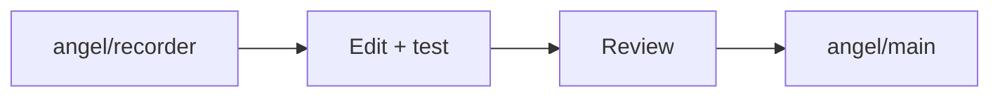

# Angel / recorder

Recorder and control panel. Recording, cameras, scene configuration, raw H5 and physical checks.

## Workflow

| Item | Rule |
| --- | --- |
| Scope | Recording, cameras, scene configuration, raw H5 and physical checks. |
| Guide | [Open workflow guide](docs/RECORDER.md) |
| Integration | Merge reviewed changes into angel/main |
| Shared source | Baseline dependencies remain available; this is a development branch, not an isolated package |
| Data and secrets | Raw recordings, logs, checkpoints and credentials stay local |
| Runtime safety | Do not switch branches while the recorder is running |

[All branches](docs/BRANCHES.md) | [Recorder](docs/RECORDER.md) | [Training](training/README.md) | [Inference](docs/INFERENCE.md) | [Debug](debug/README.md)

No model accuracy or deployment readiness is implied by this branch name.
