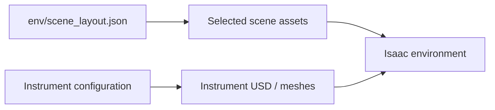

# Scene assets

[Overview](../README.md) · [Environment](../env/README.md)

| Isi | Peran |
| --- | --- |
| Hospital / table packages | Geometri scene dan dependensinya |
| Instrument USD / meshes | Lima jenis instrumen |
| Material / texture dependencies | Tampilan visual aset |
| `readme/` | Diagram statis dokumentasi |

Ada aset historis yang mungkin masih menjadi dependensi internal USD; nama file saja tidak membuktikan aset tidak terpakai. Sebelum menghapus, cek referensi USD, konfigurasi aktif, dan hasil environment test.
