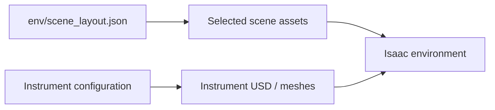

# Scene assets

[Overview](../README.md) · [Environment](../env/README.md)

| Contents | Role |
| --- | --- |
| Hospital / table packages | Scene geometry and dependencies |
| Instrument USD / meshes | Five instrument types |
| Material / texture dependencies | Asset appearance |
| `readme/` | Static documentation diagrams |

Historical assets may still be internal USD dependencies; filenames alone do not prove that an asset is unused.
Before deleting assets, inspect USD references, active configuration, and environment test results.
