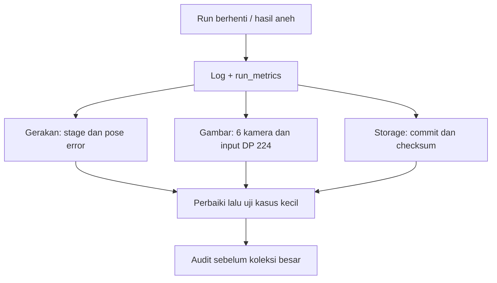

# Debug & audit

[Overview](../README.md) · [Recorder](../docs/RECORDER.md)

Output lokal di sini bukan otomatis dataset training.



| Lokasi | Isi |
| --- | --- |
| `logs/` | Console simulator/panel |
| `test_runs/` | Run pengujian |
| `validation/` | Laporan validasi |
| `output/` | Hasil audit dan visualisasi |
| `tmp/`, `archive/` | Scratch dan arsip, bukan import aktif |
| `run_metrics.json` dalam folder run | Attempt, sukses, gagal |
| `coverage_report.json` dalam folder run | Cakupan H5 dan complete |
| `.commits/` dalam folder run | Bukti transaksi H5 |

| Pesan | Arti / tindakan |
| --- | --- |
| `pose_timeout` | Pose belum mencapai toleransi; periksa stage/error |
| `P4 STATUS WARNING` | File status GUI terkunci; telemetry retry, bukan kegagalan H5 |
| `exit=0`, coverage belum lengkap | Proses berhenti tetapi goal belum tercapai |
| Checksum / commit gagal | Jangan bypass pemeriksaan untuk training |
| RGB pixelated | Periksa resolusi, framing, target pixel footprint dan hasil DP 224 |

## Audit detail RGB

Jalankan dari root proyek:

```powershell
& C:\IsaacLab\_isaac_sim\python.bat scripts\audit_rgb_detail.py `
  "<RUN_DIRECTORY>" "<NEW_AUDIT_DIRECTORY>"
```

Script membaca semua H5 yang cocok, mengambil awal/tengah/akhir tiap kamera, lalu menyimpan laporan dan contoh PNG. Ini **sampling**, bukan pemeriksaan seluruh frame atau pengukuran akurasi model.

Root `validation`, `test_runs`, `archive`, `tmp`, `output` adalah alias/junction legacy. Jangan hitung alias dan folder kanonis sebagai dataset berbeda.
