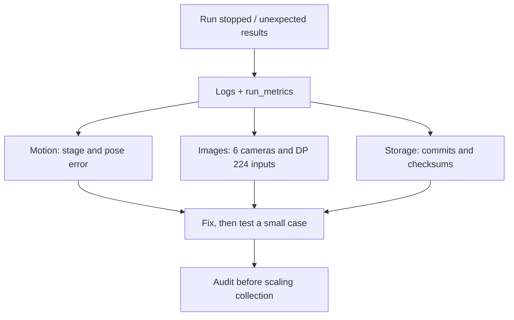

# Debug & audit

[Overview](../README.md) · [Recorder](../docs/RECORDER.md)

Local output here is not automatically approved training data.



| Location | Contents |
| --- | --- |
| `logs/` | Simulator / panel console output |
| `test_runs/` | Test recordings |
| `validation/` | Validation reports |
| `output/` | Audit results and visualizations |
| `tmp/`, `archive/` | Scratch files and archives, not active imports |
| `run_metrics.json` in a run folder | Attempts, successes, failures |
| `coverage_report.json` in a run folder | H5 coverage and completion |
| `.commits/` in a run folder | H5 transaction evidence |

| Message | Meaning / action |
| --- | --- |
| `pose_timeout` | Pose has not reached tolerance; inspect the stage and error |
| `P4 STATUS WARNING` | GUI status file is locked; telemetry retries, not an H5 failure |
| `exit=0`, incomplete coverage | The process stopped without reaching its goal |
| Checksum / commit failure | Do not bypass checks to train on the data |
| Pixelated RGB | Check resolution, framing, target pixel footprint, and DP 224 output |

## RGB detail audit

Run from the project root:

```powershell
& C:\IsaacLab\_isaac_sim\python.bat scripts\audit_rgb_detail.py `
  "<RUN_DIRECTORY>" "<NEW_AUDIT_DIRECTORY>"
```

The script reads all matching H5 files, samples the beginning/middle/end of each camera stream, and saves a report and example PNGs.
This is **sampling**, not a full-frame audit or model accuracy measurement.

Root `validation`, `test_runs`, `archive`, `tmp`, and `output` are legacy aliases/junctions.
Do not count an alias and its canonical directory as separate datasets.
