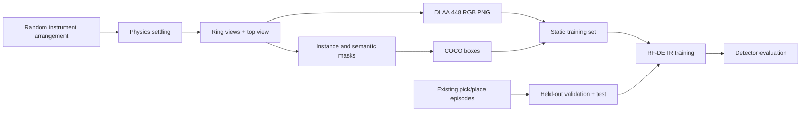

# Static Object Detection Recorder

Separate GUI and capture process for RF-DETR training. The existing DP panel,
recording stages, cameras, and datasets are not modified.



## Start the separate GUI

```powershell
cd C:\IsaacLab\scripts\custom\i4h_project\p4
.\RUN_DETECTION.ps1
```

Use **Start new** to create a timestamped collection. **Stop after scene** finishes
the current scene first. **Resume collection** selects its folder; the Scenes field
is the desired total, not the number of extra scenes. Keep the same seed/settings
for resume. DP continues to use `RUNME.ps1 -Mode panel`.

| Setting | Behavior |
|---|---|
| Scene | One new arrangement, without pick/place actions |
| Table instruments | Default 8–18; configurable 5–30; all five classes present, duplicates allowed |
| Tray | Random occupancy, empty, or full; instruments remain in fixed slots |
| Cameras | Default 8 surrounding views + 1 top; 3–16 ring views supported |
| Sensor | One sensor moves between poses; the scene stays fixed during capture |
| Quality | Native 448 × 448, DLAA, current recorder instrument materials |
| Randomization | Position, yaw, counts/classes, tray occupancy, lighting, green/teal drape, ring azimuth/elevation |
| Robot | Default visible in 25% of scenes at its static home pose; set 0% to hide it |
| Output | RGB PNG, raw semantic PNG, raw instance PNG, COCO JSON, scene metadata |
| Split | New capture is training only; no automatic repartition of existing DP data |

The camera rig covers both spawn workspace and tray. It is not the existing DP
six-camera rig. View count increases image count, not independent scene count.
Dense layouts may fail the conservative non-overlap placement check; no failed
scene is committed. This version does not deliberately stack instruments or
randomize physical scale. A static robot does not reproduce moving-arm occlusion.

## Dataset layout

```text
collection/
  config.json
  status.json
  train/
    _annotations.coco.json
    scenes/
      scene_000000/
        scene.json
        ring_00_rgb.png
        ring_00_semantic.png
        ring_00_instance.png
        ...
        top_rgb.png
```

Semantic masks store IDs, not display colors, and therefore look nearly black in
ordinary image viewers. Instance masks distinguish duplicate tools. COCO uses
visible-instance boxes, not full occluded geometry. Class IDs are 1 scalpel,
2 scissor, 3 love_retractor, 4 kelly, 5 scalpel_type2. Small instances below the
exporter's minimum visible area are omitted. Non-instrument objects remain in
semantic masks but are not detector target categories.

## Assemble RF-DETR data

First export the existing pick/place recordings with the existing COCO exporter.
Choose its detection directory containing `valid/` and `test/`. Preserve episode
grouping: frames or camera views from one episode must not cross these splits.

```powershell
& C:\IsaacLab\_isaac_sim\python.bat detection\assemble.py `
  --capture "<STATIC_COLLECTION>" `
  --evaluation "<PICK_PLACE_COCO_DIRECTORY>" `
  --output "<NEW_COMBINED_DATASET>"
```

Only static capture supplies `train/`; only existing pick/place exports supply
`valid/` and `test/`. The assembler validates images/boxes and rejects identical
images across splits. Hash checks alone cannot prove episode independence: source
evaluation splits must already satisfy that requirement. No source data is moved
or deleted. Use the existing RF-DETR setup/training workflow with the new combined
dataset; see `../training/README.md` and `rfdetr_pipeline.py --help`.

Validation may guide model selection; keep test untouched until final evaluation.
This is an explicit static-to-manipulation generalization experiment, not a promise
of deployment accuracy. Compare per-class AP and inspect occlusion failures.

## Verified smoke checks

On 2026-10-10: two scenes with 18 table instruments and five orderly tray tools,
nine views each, produced 18 RGB images and 371 visible-instance boxes. All 54
RGB/mask PNG files decoded at 448 x 448. A separate four-view collection resumed
from one to two scenes without replacing the first. Three storage/camera unit
tests passed. The standalone GUI subprocess returned exit code 0. Assembly with
an existing small pick/place evaluation export passed the RF-DETR dataset
validator; no model training or large production collection was run for this change.

## Reliability and limits

Only complete scenes are indexed. Interrupted temporary scene folders are retained
for diagnosis; resume regenerates that scene deterministically. Resume rejects
changed capture settings and missing committed files. Logs live under
`debug/logs/detection`, outside Git.

On Windows, successful capture exits after synchronous PNG/JSON writes instead of
running Isaac 5.1 USD teardown, which reproduced an access violation after saving.
Capture exceptions do not use this success exit. Small smoke tests establish file
and annotation correctness, not large-collection or model-accuracy validation.
