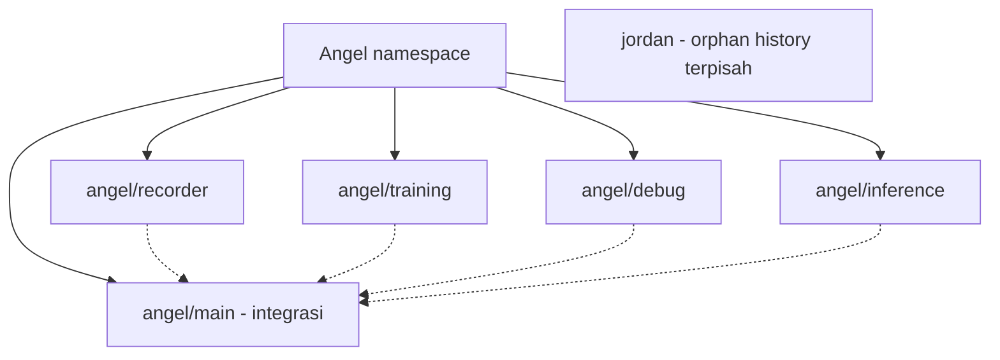
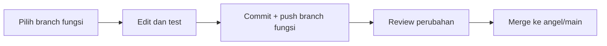

# Branch workflow

[Overview](../README.md)

`angel/main` adalah branch integrasi Angel. Branch fungsi dimulai dari baseline
yang sama supaya dependensi recorder, exporter dan runtime tetap kompatibel.
Ini pemisahan jalur pengembangan, bukan pemotongan source menjadi paket mandiri.



| Branch | Tanggung jawab | Panduan |
| --- | --- | --- |
| `angel/main` | Integrasi/stabil; default GitHub | [Overview](../README.md) |
| `angel/recorder` | Recorder, panel, camera, raw H5 | [Recorder](RECORDER.md) |
| `angel/training` | Export, detector, DP, evaluasi | [Training](../training/README.md) |
| `angel/debug` | Diagnosis dan eksperimen | [Debug](../debug/README.md) |
| `angel/inference` | Runtime dan controller integration | [Inference](INFERENCE.md) |
| `jordan` | Orphan history: awal hanya README, tanpa source Angel | README pada branch Jordan |
| `main` | Snapshot sebelum reorganisasi; tidak untuk pekerjaan baru | Commit `7c37aed` |

Git tidak punya branch parent/child; `angel/` hanya prefix nama.
Tidak bisa membuat ref `angel` sekaligus `angel/main`.

| Aturan | Pelaksanaan |
| --- | --- |
| Perubahan recorder / kamera | Kerjakan di `angel/recorder` |
| Perubahan export / training | Kerjakan di `angel/training` |
| Perubahan diagnosis / eksperimen | Kerjakan di `angel/debug` |
| Perubahan runtime model | Kerjakan di `angel/inference` |
| Integrasi | Review dan uji perubahan sebelum merge ke `angel/main` |
| Export panel | Tetap tersedia pada baseline bersama; implementasi dipelihara di `angel/training` |
| Dataset, log, credential | Tetap lokal/ignored; bukan isi branch Jordan |

## Cara kerja



Contoh setelah recorder berhenti dan working tree bersih:

```powershell
git switch angel/recorder
git pull --ff-only
```

Jangan merge seluruh branch Jordan ke Angel: riwayatnya sengaja terpisah.
Branch tidak mengubah aturan data split, batas policy, atau kualitas dataset.

Branch bukan tempat menyimpan dataset atau API key. Jangan switch branch saat recorder berjalan; gunakan checkout/worktree terpisah bila menjalankan workflow paralel.
