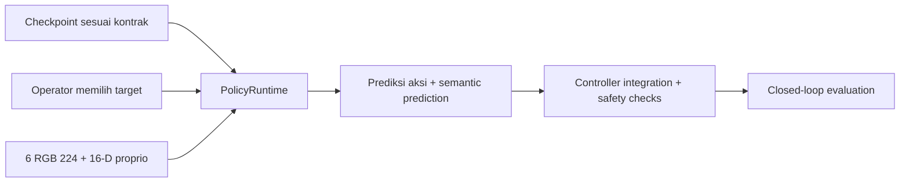
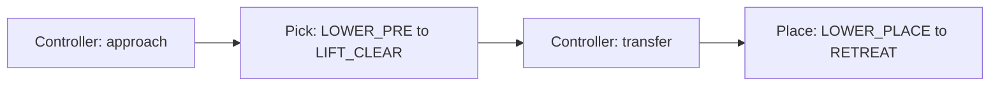

# Inference

[Overview](../README.md) · [Training](../training/README.md)

Implementasi: `training/runtime.py`. Ini API prediksi, bukan aplikasi robot siap deployment.



| Syarat | Aturan |
| --- | --- |
| Checkpoint | `p4_sensor_task_v2`; skill sesuai checkpoint |
| Target | `set_target('scissor')`, pilihan operator |
| RGB | 6 uint8 224 x 224; adapter live resize 448 dengan Lanczos |
| Proprio | 16 nilai terukur, frame robot-base |
| Timing | `observe()` setiap tick, termasuk saat cached action dijalankan |
| Episode / skill baru | Reset history |
| Smoke checkpoint | Ditolak untuk deployment secara default |
| GT simulator | Bukan input model |

## API prediksi

```python
from training.runtime import PolicyRuntime

policy = PolicyRuntime("<CHECKPOINT_PATH>", device="cpu")
policy.set_target("scissor")
policy.observe(sensors)  # dictionary RGB + robot_proprio dari sensor
actions, semantic_prediction = policy.predict()
```

Contoh ini tidak membuat environment atau mengeksekusi robot. Integrasi live memakai `read_live_sensors(env)`, kontrak controller melalui `attach_controller(env)`, dan pemeriksaan keselamatan di luar input model.



Belum ada bukti learned closed-loop yang cukup untuk klaim deployment. Aksi finite bukan bukti berhasil memanipulasi.
