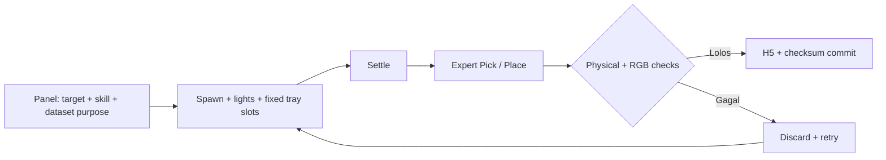
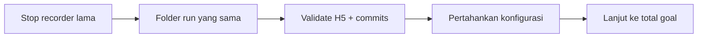

# Recorder

[Overview](../README.md) · [Environment](../env/README.md) · [Debug](../debug/README.md)



| Pilihan | Mengontrol | Bukan |
| --- | --- | --- |
| Pick / Place / Both | Segmen yang disimpan | Jenis model |
| Detection / DP / Both | Tujuan export | Training saat recording |
| 224 / 448 | Resolusi raw | Ukuran input DP; tetap 224 |
| Tray occupancy | Isi awal pada slot tetap | Tempat clutter acak |
| Distractor range | Total non-target, termasuk 4 base bodies | Jumlah target |
| Split / seed otomatis | Pembagian sesi dan randomisasi | Split per frame |

Target type hanya satu. Duplikat tambahan hanya di meja. Scene tidak muat ditolak, bukan dialihkan ke tray.

## Run

```powershell
cd "<PROJECT_DIRECTORY>"
.\RUNME.ps1 -Mode panel
```

| Tab | Fungsi |
| --- | --- |
| Record & live log | Target, spawn, skill, episode/coverage |
| Dataset & tray | Dataset purpose, resolusi, folder, tray, distractors |
| Files & export | Buka hasil dan export koleksi selesai |

## Resume



```powershell
& C:\IsaacLab\_isaac_sim\python.bat record.py `
  --object <OBJECT_NAME> --resume --episodes <TOTAL_GOAL> `
  --record_mode <pick|place|both> --max-attempts 0 `
  --out_dir "<RUN_DIRECTORY>" --session-config "<RUN_DIRECTORY>\session.json" `
  --camera-size <ORIGINAL_SIZE> --randomization-seed <ORIGINAL_SEED> `
  --dataset-purpose <ORIGINAL_PURPOSE> --dataset-split <ORIGINAL_SPLIT> `
  --tray-occupancy <ORIGINAL_TRAY_MODE>
```

Ganti semua placeholder, termasuk pilihan bertanda `|`, dengan satu nilai nyata.
38 tersimpan menuju 100 berarti `--episodes 100`, bukan 62. Resume mempertahankan layout kamera manifest. Session JSON mempertahankan range distractor. Pastikan session tidak sedang meminta stop.

| Pertahankan | Jika ingin mengubah |
| --- | --- |
| Resolusi, layout, seed, split, skill, purpose | Buat sesi/folder baru |
| H5 dan commit selesai | Jangan ditimpa |
| Satu recorder per output | Jangan launch dua proses ke folder sama |

File valid bukan bukti visual cukup tajam atau policy mampu manipulasi. Periksa keenam kamera, hasil DP 224, serta evaluasi held-out.
