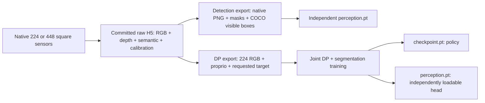

# Recording and training contract v2

## Independent artifacts



The scene supports repeated non-target instrument types: default 12-18 distractors
plus exactly one target. Raw H5 records per-body instance masks, and COCO exports
derive one visible box per physical instrument, even when its mask has disconnected
parts. The bundled semantic model still predicts classes, not separate instances;
use the COCO instance boxes with an instance-aware detector for duplicate objects. Connecting
these outputs to a different action model still requires that model's input adapter.
GT labels never condition DP inference.

With table distractors, DP needs an explicit requested target. The existing panel
Target / CLI `--object` selection supplies that task during recording. Export stores
it separately as `task_target`; it contains only the requested instrument type,
never object position, segmentation or a simulator-selected grasp. One policy per
skill can train across all five targets. At inference call
`policy.set_target('scissor')` before supplying RGB/robot sensors. Checkpoints now use
`p4_sensor_task_v2`; regenerate old exports and retrain. Full tray is not required.

## Camera

2026-09-27 front framing: new sessions use a closer oblique-downward view of
the main tabletop work grid, rather than including the front table fascia and
large room margins. Tray-specific detail remains the tray camera's role. Front
pose and focal length are stored in camera_layout.json. Resume loads the original
session manifest's layout, preserving its old view; use a new session for the
new framing. No stored RGB is cropped or upscaled by this change.
The final 448 front view passed a simulator scene audit and visual inspection;
it reduces the lower fascia, but does not eliminate every table edge/background
pixel. Projection tests include all work-grid corners at Z=0 and Z=0.10 m.
This checks framing, not recognition accuracy or all moving-arm occlusions.

Audit of the existing 224 love_retractor session (38 pairs / 76 H5 files): three
temporal samples per camera/file gave 1,368 frames. Median target semantic area
in front was only 7 pixels; in wrist it was 1,441.5 pixels. These are visible
label areas, not blur scores or accuracy estimates. Small target area and zoom
pixelation make this collection unsuitable as proof of robust recognition.
It can still support pipeline experiments; actual learning quality requires
held-out model evaluation. The audit samples frames, not every RGB frame.

Native square rendering uses 0.75 times the original horizontal aperture for a
wider view than the historical center crop. No crop or image resize
occurs while saving raw H5. `--camera-size 448` is the default for small tools,
sampling the same field of view with four times the pixels of low-memory 224.
DLSS upscaling and frame generation are disabled; direct lighting uses 4 samples/pixel.
Spatial FXAA smooths jagged edges without temporal accumulation. It does not
restore missing detail; direct-lighting samples are not resolution supersampling.
Compare saved frames at native scale. RGB preview folders now include all six
cameras; these PNGs remain a sampled preview, while H5 contains every saved frame.
An old center crop itself did not interpolate pixels; renderer resolution and small
instrument pixel footprint also affect apparent sharpness.

The DP exporter and live DP sensor adapter both use the same Lanczos resize from
448 to 224. Semantic labels use nearest-neighbor. Detection exports retain native
pixels. Higher resolution cannot retroactively recover detail from old recordings.

Native-448 + FXAA scene audit (2026-09-26) completed successfully with six RGB
and semantic views and 12 distractors. The preview was visually inspected;
thin tools still occupy few pixels in wide front/top views. Eleven regression
tests passed, including all-five-backend six-view PNG exports, unchanged raw
pixels during DP downsampling, capture/storage guards and panel commands.
This is a scene/render check, not a complete 448 training run or accuracy claim.

## Randomization and collection

Every episode gets seeded key/fill positions, table/tray-directed light cones,
intensities, colors, and ambient intensity. Changes occur before settle and RGB
warmup; lighting is fixed through the recorded trajectory. H5 stores the sampled
configuration in `domain_randomization`. Light cone implementation follows
[UsdLux ShapingAPI](https://openusd.org/release/api/class_usd_lux_shaping_a_p_i.html).
Auto spawning already supplies bounded XY jitter and yaw in [0,360); independent
session seeds now control this RNG as well. Manual poses remain exact.

DP, perception, and shared collection can randomize tray occupancy. The target always
starts on the table, while non-target classes can split between tabletop distractors
and tray slots; random mode keeps at least one non-target on the table for clutter and
natural occlusion. Both keep physical gates. The selected table drape
now varies across seeded green/teal-green material colors and roughness; this changes
appearance only, not collision geometry or instrument materials. Physical scale and room
geometry are unchanged; novel rooms and real-camera
domain coverage require separate validation. No synthetic image filter is recorded
as a new independent episode.

The panel's **Total distractors, random range** excludes the target and includes
the four base non-target bodies. Extra bodies repeat those four types on the table
only. The target type is excluded from duplicates. Base tray choices only control
the four original bodies, which occupy their ordered fixed slots. Extras use randomized tabletop placement,
measured footprint rejection and the same pose-stability gates as the originals;
the target grasp area and the entire tray stay clear of extras, including after settling. Impossible packing is
rejected rather than silently reducing the requested count. Restart the simulator
after changing the range. CLI equivalents: `--distractor-min 12 --distractor-max 18`.

Table-only correction verified on 2026-09-26: a native-224 scene audit with 12
total distractors passed settling and fixed-slot checks. All eight extra bodies
were on the table; three original non-target bodies occupied their ordered tray
slots, with the target lane empty. Nine clutter tests, nine tray tests and three
panel tests passed. This preview check is not a learned-policy rollout or a new
training demonstration; old recordings are not retroactively corrected.

Semantic IDs 0-7 are unchanged; 8=table, 9=floor, 10=room. Every instrument retains
its class label and a separate rigid-body instance ID. New training heads have 11
semantic outputs; old 8-class checkpoints require retraining/migration. Preview and
pixel counts are saved in `scene_camera_semantic_preview.png` and `scene_label_audit.json`.
Labels outside a camera's view or fully occluded correctly have no pixels.
Robot submeshes, including otherwise unlabeled joints, are resolved from the
renderer instance-to-prim mapping. A scene-only check writes the preview without
creating demonstrations: add `--scene-audit-only` to a normal recorder command.

Replace placeholders; run from P4. `--run` starts collection and may take hours.
The default plan uses 2 train seeds, 1 validation seed, 1 test seed, all five classes
and 10 cells in one cycle: 200 pairs. Review the plan and storage first. `both` shares
one DP-compatible raw corpus between the two exporters; it is not two recordings.
This smaller initial budget does not establish that 200 pairs are sufficient.

```powershell
$IsaacPython = '<ISAACLAB_ROOT>\_isaac_sim\python.bat'
python scripts\collect_training.py --track dp --output '<NEW_DP_RAW_ROOT>'
python scripts\collect_training.py --track both --output '<NEW_SHARED_RAW_ROOT>'
python scripts\collect_training.py --track dp --output '<NEW_DP_RAW_ROOT>' --python $IsaacPython --run
python scripts\collect_training.py --track perception --output '<NEW_DETECTION_RAW_ROOT>' --python $IsaacPython --run

& $IsaacPython training\export_sensor_only.py --source '<COMPLETE_DP_RAW_ROOT>' --output '<NEW_DP_EXPORT>'
& $IsaacPython training\export_detection.py --train-runs '<TRAIN_RUN_1>' '<TRAIN_RUN_2>' --valid-runs '<VALID_RUN>' --test-runs '<TEST_RUN>' --output '<NEW_DETECTION_EXPORT>' --stride 20

& $IsaacPython training\train_perception.py --dataset '<DETECTION_EXPORT>' --output '<NEW_PERCEPTION_RUN>' --size 448 --steps 1000 --device cuda
& $IsaacPython training\train_sensor_policy.py --dataset '<DP_EXPORT>' --output '<NEW_PICK_RUN>' --skill pick --steps 1000 --device cuda
# Repeat joint training separately for place.
```

## GUI workflow

1. **Record & live log**: choose saved motion `pick`, `place`, or `both` independently
   from the dataset purpose. Choose target, manual/auto, and successful episode goal.
2. **Dataset & tray**: choose `Both: DP + detector (recommended)` for the complete
   capture path, or select detector-only / DP-only for narrower experiments. Select
   recorded image size and a destination on the desired drive. The GUI assigns seed
   and train/valid/test automatically with a 70/20/10 session ratio. Manual spawn
   does not automatically add XY/yaw jitter; choose auto.
3. Random tray occupancy is valid for DP, detector-only, and Both. Full tray remains
   available as a special controlled setting, while manual lets you choose which
   non-target classes start in tray slots. Each saved skill retains RGB/masks/robot evidence; purpose describes
   the consumers in `capture_contract.json`, not a separately trained model.
4. **Launch + record** starts recording. Capacity is checked before launch and a
   30 GB reserve is checked before each new attempt. Existing data is not deleted.
5. Collect independent train, valid and test sessions beneath one collection root.
   **Files & export -> Export collection for training...** validates the sessions
   and writes separate `detection/` and/or `dp/` artifacts to a new folder. An
   missing split or seed leakage is rejected, never silently split by frame.
   Pick-only/place-only sessions are supported; train only the skills you collected.

Equivalent GUI-collection export:

```powershell
& $IsaacPython training\export_recordings.py --source '<GUI_COLLECTION_ROOT>' --output '<NEW_EXPORT_OUTSIDE_RAW_ROOT>' --purpose both
```

Exports do not duplicate raw recordings, but derived files still require extra
storage. Recorder and export console logs are under `debug/logs/`; completion,
coverage, provenance and metrics JSON remain beside raw data.

## Windows shutdown contract

A native graceful-cleanup trial reproduced an access violation in `omni.usd`
extension shutdown after committed saves. Windows defaults to `--shutdown-mode
verified-exit`: after saved-goal/coverage checks, verify every selected segment's
v2 commit and checksum, fsync `run_completion.json`, flush logs, then terminate the
isolated process with code 0. Windows reclaims process/GPU resources. Native Kit
extension teardown is deliberately skipped, not repaired; `--shutdown-mode native`
remains available for diagnosis. Failed checks never take this success exit path.
Do not equate a PowerShell stderr/redirection error flag with the child process
exit code: inspect `$LASTEXITCODE` or `subprocess.returncode`.

1000 steps is an example budget, not a quality guarantee. Keep test sessions out of
model selection. `train_perception` reports semantic IoU and visible-box AP50 (not COCO AP50:95). Model
deployment additionally requires held-out detection metrics and learned closed-loop
pick/place evaluation. Successful expert recording is not learned-policy rollout.

```python
from training.perception import PerceptionRuntime
detector = PerceptionRuntime('<PERCEPTION_CHECKPOINT>')
result = detector.predict(rgb_uint8)  # mask + class boxes + mean pixel confidence
```

## Evidence and limits, 2026-09-25

- Historical baseline: 50 successful pick/place pairs; existing content, FK and
  pipeline checks passed. It remains a fixed-cell/yaw baseline.
- Raw panel inventory: 500 scalpel pairs plus 1 scissor pair; this is a header
  inventory only. Other instruments may occur as visual distractors, but these
  are not 500 independent manipulation demonstrations for every class.
- Old panel recordings have no sampled lighting provenance.
- 70 tests passed (49 recorder regressions, 11 storage/input contracts, 10 new
  camera/randomization/export/perception/AP50 tests). New bounded camera recordings are stored in
  `debug/validation/training_readiness_v2/` and `debug/test_runs/native*_light_v2*`.
- After GUI integration: 44 root tests, 53 legacy non-GUI tests, 10 GUI regressions,
  and 2 dataset-panel tests passed (109 total; the latter covers all nine
  purpose/motion combinations). Publish hygiene and repository structure checks pass.
- Perception and joint smoke checkpoints only demonstrate executable training.
  They are marked non-deployable. New broad-cohort collection, model accuracy,
  novel backgrounds and learned rollouts remain required before certification.
- Real native 224 and native 448 trials each saved one expert pick/place pair.
  The 448 trial passed full-frame physical/topic/calibration/checksum audits:
  232 pick frames and 150 place frames, with no raw crop/resize. Evidence:
  `debug/validation/training_readiness_v2/native448_audit/report.json` and
  `pick_native.png` / `place_native.png` in the same directory.
- Native graceful shutdown reproduced an access violation (v3). The v4 run saved
  the randomized-background pair and passed checksum-gated process completion.
  A resume check against those committed files confirmed actual child exit code 0.
  Full v4 audit passed all 232 pick and 150 place frames at native 224, including
  physical/topic/calibration/checksum gates (`v4_audit/report.json`).
  Detailed logs stay under `debug/validation/training_readiness_v2/shutdown_v*.log`.

No manifest is changed to `production_ready: true` solely because code/tests pass.

Duplicate-instance validation (2026-09-26): a native-224 scissor run completed one
pick/place pair with 12 distractors and one target, passing per-frame semantic /
instance consistency and committed-file checks. The preceding 17-distractor attempt
failed settling and was discarded. Detector export produced 36 sampled images and
314 separate visible-instance boxes; DP export and a task-conditioned forward /
diffusion smoke test passed. These checks do not establish learned-policy accuracy.
Evidence remains local under `debug/test_runs/clutter_v2_verified_20260926` and the
matching detector/DP export folders.

The earlier 448 demo consumes approximately 561 MB per pair. Two separate 500-pair
plans would have been roughly 560 GB. With added instance masks, the shared
200-pair plan budgets 220 GB at 448 or 60 GB at 224, plus a 30 GB reserve.
Disk free space is checked live before collection and every attempt.
The full initial cohort has not been collected or accuracy-certified. Export files
and models need additional capacity. Larger cohorts can increase cycles/seeds after
reviewing learning curves, class coverage, occlusion coverage and held-out rollouts.
