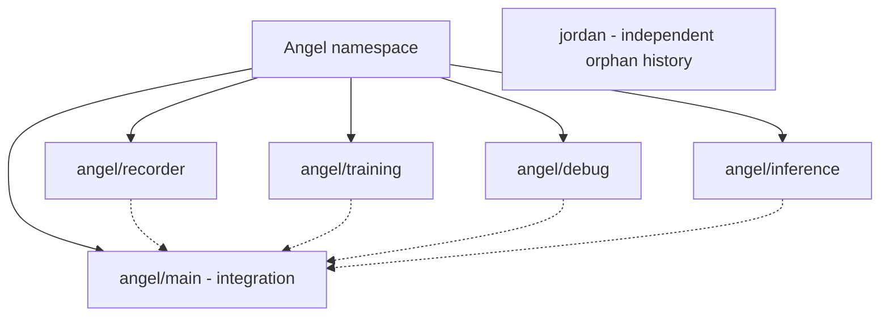
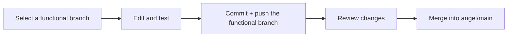

# Branch workflow

[Overview](../README.md)

`angel/main` is Angel's integration branch. Functional branches start from the same baseline to keep recorder, exporter, and runtime dependencies compatible.
These are separate development tracks, not independently packaged source subsets.



| Branch | Responsibility | Guide |
| --- | --- | --- |
| `angel/main` | Stable integration; GitHub default | [Overview](../README.md) |
| `angel/recorder` | Recorder, panel, cameras, raw H5 | [Recorder](RECORDER.md) |
| `angel/training` | Export, detector, DP, evaluation | [Training](../training/README.md) |
| `angel/debug` | Diagnostics and experiments | Branch-local documentation |
| `angel/inference` | Runtime and controller integration | [Inference](INFERENCE.md) |
| `jordan` | Orphan history: initially README-only, with no Angel source | README on the Jordan branch |
| `main` | Legacy code baseline; not for new feature work | Code baseline at `7c37aed`; documentation may receive maintenance updates |

Git does not have parent/child branches; `angel/` is a naming prefix.
A ref named `angel` cannot coexist with `angel/main`.

| Rule | Practice |
| --- | --- |
| Recorder / camera changes | Work on `angel/recorder` |
| Export / training changes | Work on `angel/training` |
| Diagnostics / experiments | Work on `angel/debug` |
| Model runtime changes | Work on `angel/inference` |
| Integration | Review and test changes before merging into `angel/main` |
| Panel export | Available in the shared baseline; maintained on `angel/training` |
| Datasets, logs, credentials | Keep local / ignored; not part of Jordan |

## Development flow



Example after stopping the recorder and cleaning up the working tree:

```powershell
git switch angel/recorder
git pull --ff-only
```

Do not merge the entire Jordan branch into Angel; their histories are intentionally separate.
Branches do not change data-split rules, policy boundaries, or dataset quality.

Do not store datasets or API keys in branches. Do not switch branches while recording; use separate checkouts/worktrees for parallel workflows.
