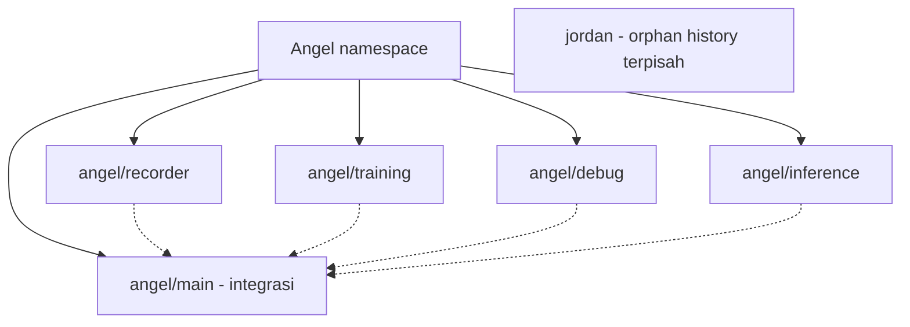

# Rencana branch

[Overview](../README.md)

**Belum diterapkan.** Repo yang diperiksa masih memakai `main`. Nama berikut adalah rencana, bukan branch yang sudah tersedia.

| Branch rencana | Tanggung jawab | Panduan |
| --- | --- | --- |
| `angel/main` | Integrasi/stabil; batas isi perlu konfirmasi | [Overview](../README.md) |
| `angel/recorder` | Recorder, panel, camera, raw H5 | [Recorder](RECORDER.md) |
| `angel/training` | Export, detector, DP, evaluasi | [Training](../training/README.md) |
| `angel/debug` | Diagnosis dan eksperimen | [Debug](../debug/README.md) |
| `angel/inference` | Runtime dan controller integration | [Inference](INFERENCE.md) |
| `jordan` | Awal hanya README, tanpa source Angel | Belum dibuat |

Git tidak punya branch parent/child; `angel/` hanya prefix nama.
Tidak bisa membuat ref `angel` sekaligus `angel/main`.

| Keputusan | Status |
| --- | --- |
| Default GitHub menjadi `angel/main` | Menunggu konfirmasi |
| `main` lama menjadi cadangan | Usulan |
| Export panel pindah ke training | Menunggu keputusan |
| Pemisahan source antarbranch | Belum dilakukan |
| Hapus dataset/log lokal | Tidak termasuk reorganisasi |

Branch bukan tempat menyimpan dataset atau API key. Jangan switch branch saat recorder berjalan; gunakan checkout/worktree terpisah bila menjalankan workflow paralel.
