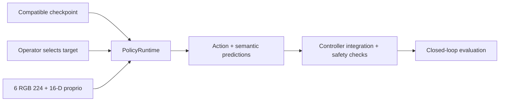
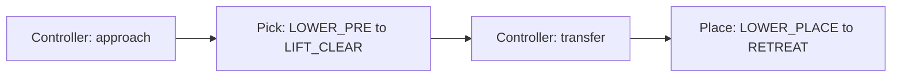

# Inference

[Overview](../README.md) · [Training](../training/README.md)

Implementation: `training/runtime.py`. This is a prediction API, not a deployment-ready robot application.



| Requirement | Rule |
| --- | --- |
| Checkpoint | `p4_sensor_task_v2`; use the checkpoint's skill |
| Target | `set_target('scissor')`, selected by the operator |
| RGB | Six uint8 224 x 224 views; the live adapter resizes 448 with Lanczos |
| Proprioception | 16 measured values in the robot-base frame |
| Timing | Call `observe()` every tick, including while executing cached actions |
| New episode / skill | Reset observation history |
| Smoke checkpoint | Rejected for deployment by default |
| Simulator GT | Not a model input |

## Prediction API

```python
from training.runtime import PolicyRuntime

policy = PolicyRuntime("<CHECKPOINT_PATH>", device="cpu")
policy.set_target("scissor")
policy.observe(sensors)  # RGB + robot_proprio dictionary from sensors
actions, semantic_prediction = policy.predict()
```

This example does not create an environment or execute the robot.
Live integration uses `read_live_sensors(env)`, the controller contract through `attach_controller(env)`, and safety checks outside the model inputs.



Learned closed-loop evidence is not sufficient to claim deployment readiness.
Finite actions do not prove successful manipulation.
