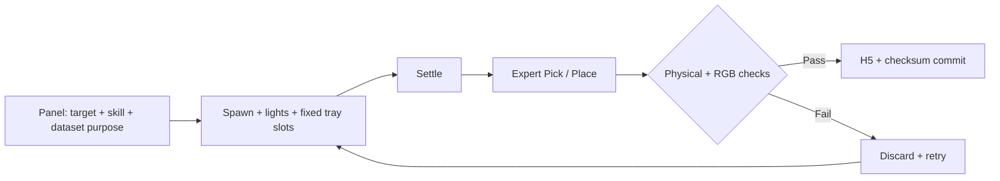
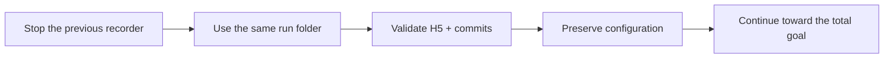

# Recorder

[Overview](../README.md) · [Environment](../env/README.md)



| Option | Controls | Does not control |
| --- | --- | --- |
| Pick / Place / Both | Saved motion segments | Model type |
| Detection / DP / Both | Export targets | Training during recording |
| 224 / 448 | Raw resolution | DP input size, which remains 224 |
| Tray occupancy | Initial occupants in fixed slots | Random clutter placement |
| Distractor range | Total non-targets, including 4 base bodies | Target count |
| Automatic split / seed | Committed episode assignment, grid balance, seeded randomization | Per-frame splitting |

The target type appears exactly once. Extra duplicates are table-only.
Scenes that do not fit are rejected rather than placing overflow in the tray.

## Run

```powershell
cd "<PROJECT_DIRECTORY>"
.\RUNME.ps1 -Mode panel
```

| Tab | Purpose |
| --- | --- |
| Record & live log | Target, spawn, skill, episode count / coverage |
| Dataset & tray | Dataset purpose, resolution, folder, tray, distractors |
| Files & export | Open results and export completed collections |

## Resume



```powershell
& C:\IsaacLab\_isaac_sim\python.bat record.py `
  --object <OBJECT_NAME> --resume --episodes <TOTAL_GOAL> `
  --record_mode <pick|place|both> --max-attempts 0 `
  --out_dir "<RUN_DIRECTORY>" --session-config "<RUN_DIRECTORY>\session.json" `
  --camera-size <ORIGINAL_SIZE> --randomization-seed <ORIGINAL_SEED> `
  --dataset-purpose <ORIGINAL_PURPOSE> --dataset-split <ORIGINAL_SPLIT> `
  --tray-occupancy <ORIGINAL_TRAY_MODE>
```

Replace every placeholder, including alternatives separated by `|`, with one actual value.
If 38 episodes are saved toward a goal of 100, use `--episodes 100`, not 62.
Resume preserves the manifest's camera layout. The session JSON preserves the distractor range.
Make sure the session is not requesting a stop.

| Preserve | To change it |
| --- | --- |
| Resolution, layout, seed, split, skill, purpose | Start a new session / folder |
| Completed H5 files and commits | Do not overwrite them |
| One recorder per output folder | Do not launch two processes into the same folder |

Valid files do not prove sufficient visual detail or manipulation competence.
Inspect all six cameras, the DP 224 output, and held-out evaluation results.
