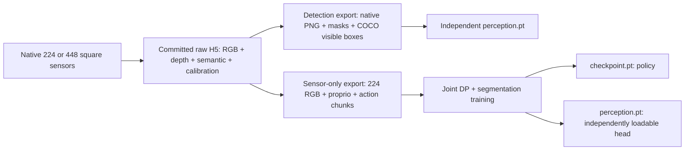

# Recording and training contract v2

## Independent artifacts



The independent model currently predicts semantic classes and visible class boxes;
the scene supports one instance of each class. It does not separate two instruments
of the same class. COCO exports can also feed a different box detector. Connecting
these outputs to a different action model still requires that model's input adapter.
GT labels never condition DP inference.

## Camera

Native square rendering preserves historical angular framing by halving the
horizontal aperture relative to the old 448-wide sensor. No crop or image resize
occurs while saving raw H5. `--camera-size 224` is the low-memory default;
`--camera-size 448` samples the same field of view with four times the pixels.
DLSS upscaling and frame generation are disabled; direct lighting uses 4 samples/pixel.
Without antialiasing, fine edges can alias. Compare saved frames at native scale.
An old center crop itself did not interpolate pixels; renderer resolution and small
instrument pixel footprint also affect apparent sharpness.

The DP exporter and live DP sensor adapter both use the same Lanczos resize from
448 to 224. Semantic labels use nearest-neighbor. Detection exports retain native
pixels. Higher resolution cannot retroactively recover detail from old recordings.

## Randomization and collection

Every episode gets seeded key/fill positions, table/tray-directed light cones,
intensities, colors, and ambient intensity. Changes occur before settle and RGB
warmup; lighting is fixed through the recorded trajectory. H5 stores the sampled
configuration in `domain_randomization`. Light cone implementation follows
[UsdLux ShapingAPI](https://openusd.org/release/api/class_usd_lux_shaping_a_p_i.html).
Auto spawning already supplies bounded XY jitter and yaw in [0,360); independent
session seeds now control this RNG as well. Manual poses remain exact.

DP collection uses a full non-target tray to retain one actionable tabletop object.
Perception collection randomizes tray occupancy, yielding more tabletop distractors
and naturally varying occlusions. Both keep physical gates. The selected table drape
now varies across seeded teal/blue/grey material colors and roughness; this changes
appearance only, not collision geometry or instrument materials. Physical scale and room
geometry are unchanged; novel rooms, duplicate-class scenes, and real-camera
domain coverage require separate validation. No synthetic image filter is recorded
as a new independent episode.

Replace placeholders; run from P4. `--run` starts collection and may take hours.
The default plan uses 2 train seeds, 1 validation seed, 1 test seed, all five classes
and 10 cells in one cycle: 200 pairs. Review the plan and storage first. `both` shares
one DP-compatible raw corpus between the two exporters; it is not two recordings.
This smaller initial budget does not establish that 200 pairs are sufficient.

```powershell
$IsaacPython = '<ISAACLAB_ROOT>\_isaac_sim\python.bat'
python scripts\collect_training.py --track dp --output '<NEW_DP_RAW_ROOT>'
python scripts\collect_training.py --track both --output '<NEW_SHARED_RAW_ROOT>'
python scripts\collect_training.py --track dp --output '<NEW_DP_RAW_ROOT>' --python $IsaacPython --run
python scripts\collect_training.py --track perception --output '<NEW_DETECTION_RAW_ROOT>' --python $IsaacPython --run

& $IsaacPython training\export_sensor_only.py --source '<COMPLETE_DP_RAW_ROOT>' --output '<NEW_DP_EXPORT>'
& $IsaacPython training\export_detection.py --train-runs '<TRAIN_RUN_1>' '<TRAIN_RUN_2>' --valid-runs '<VALID_RUN>' --test-runs '<TEST_RUN>' --output '<NEW_DETECTION_EXPORT>' --stride 20

& $IsaacPython training\train_perception.py --dataset '<DETECTION_EXPORT>' --output '<NEW_PERCEPTION_RUN>' --size 448 --steps 1000 --device cuda
& $IsaacPython training\train_sensor_policy.py --dataset '<DP_EXPORT>' --output '<NEW_PICK_RUN>' --skill pick --steps 1000 --device cuda
# Repeat joint training separately for place.
```

## GUI workflow

1. **Record & live log**: choose saved motion `pick`, `place`, or `both` independently
   from the dataset purpose. Choose target, manual/auto, and successful episode goal.
2. **Dataset & tray**: choose `Detection only`, `DP + detection (joint)`, or
   `Both (shared raw, separate models)`. Select native 224/448, a destination on the
   desired drive, a whole-session split, and a seed. Use different seeds across
   train/valid/test. Manual spawn does not automatically add XY/yaw jitter; choose auto.
3. DP/Both require a full non-target tray. Detection-only defaults to random tray
   occupancy. Each saved skill retains RGB/masks/robot evidence; purpose describes
   the consumers in `capture_contract.json`, not a separately trained model.
4. **Launch + record** starts recording. Capacity is checked before launch and a
   30 GB reserve is checked before each new attempt. Existing data is not deleted.
5. Collect independent train, valid and test sessions beneath one collection root.
   **Files & export -> Export collection for training...** validates the sessions
   and writes separate `detection/` and/or `dp/` artifacts to a new folder. An
   unassigned split or seed leakage is rejected, never silently split by frame.
   Pick-only/place-only sessions are supported; train only the skills you collected.

Equivalent GUI-collection export:

```powershell
& $IsaacPython training\export_recordings.py --source '<GUI_COLLECTION_ROOT>' --output '<NEW_EXPORT_OUTSIDE_RAW_ROOT>' --purpose both
```

Exports do not duplicate raw recordings, but derived files still require extra
storage. Recorder and export console logs are under `debug/logs/`; completion,
coverage, provenance and metrics JSON remain beside raw data.

## Windows shutdown contract

A native graceful-cleanup trial reproduced an access violation in `omni.usd`
extension shutdown after committed saves. Windows defaults to `--shutdown-mode
verified-exit`: after saved-goal/coverage checks, verify every selected segment's
v2 commit and checksum, fsync `run_completion.json`, flush logs, then terminate the
isolated process with code 0. Windows reclaims process/GPU resources. Native Kit
extension teardown is deliberately skipped, not repaired; `--shutdown-mode native`
remains available for diagnosis. Failed checks never take this success exit path.
Do not equate a PowerShell stderr/redirection error flag with the child process
exit code: inspect `$LASTEXITCODE` or `subprocess.returncode`.

1000 steps is an example budget, not a quality guarantee. Keep test sessions out of
model selection. `train_perception` reports semantic IoU and visible-box AP50 (not COCO AP50:95). Model
deployment additionally requires held-out detection metrics and learned closed-loop
pick/place evaluation. Successful expert recording is not learned-policy rollout.

```python
from training.perception import PerceptionRuntime
detector = PerceptionRuntime('<PERCEPTION_CHECKPOINT>')
result = detector.predict(rgb_uint8)  # mask + class boxes + mean pixel confidence
```

## Evidence and limits, 2026-09-25

- Historical baseline: 50 successful pick/place pairs; existing content, FK and
  pipeline checks passed. It remains a fixed-cell/yaw baseline.
- Raw panel inventory: 500 scalpel pairs plus 1 scissor pair; this is a header
  inventory only. Other instruments may occur as visual distractors, but these
  are not 500 independent manipulation demonstrations for every class.
- Old panel recordings have no sampled lighting provenance.
- 70 tests passed (49 recorder regressions, 11 storage/input contracts, 10 new
  camera/randomization/export/perception/AP50 tests). New bounded camera recordings are stored in
  `debug/validation/training_readiness_v2/` and `debug/test_runs/native*_light_v2*`.
- After GUI integration: 44 root tests, 53 legacy non-GUI tests, 10 GUI regressions,
  and 2 dataset-panel tests passed (109 total; the latter covers all nine
  purpose/motion combinations). Publish hygiene and repository structure checks pass.
- Perception and joint smoke checkpoints only demonstrate executable training.
  They are marked non-deployable. New broad-cohort collection, model accuracy,
  novel backgrounds and learned rollouts remain required before certification.
- Real native 224 and native 448 trials each saved one expert pick/place pair.
  The 448 trial passed full-frame physical/topic/calibration/checksum audits:
  232 pick frames and 150 place frames, with no raw crop/resize. Evidence:
  `debug/validation/training_readiness_v2/native448_audit/report.json` and
  `pick_native.png` / `place_native.png` in the same directory.
- Native graceful shutdown reproduced an access violation (v3). The v4 run saved
  the randomized-background pair and passed checksum-gated process completion.
  A resume check against those committed files confirmed actual child exit code 0.
  Full v4 audit passed all 232 pick and 150 place frames at native 224, including
  physical/topic/calibration/checksum gates (`v4_audit/report.json`).
  Detailed logs stay under `debug/validation/training_readiness_v2/shutdown_v*.log`.

No manifest is changed to `production_ready: true` solely because code/tests pass.

The earlier 448 demo consumes approximately 561 MB per pair. Two separate 500-pair
plans would have been roughly 560 GB. The new shared 200-pair initial plan budgets
180 GB raw conservatively plus a 30 GB reserve; it passed the latest local capacity
check (about 354 GB free). Disk free space is live, not guaranteed by this document.
The full initial cohort has not been collected or accuracy-certified. Export files
and models need additional capacity. Larger cohorts can increase cycles/seeds after
reviewing learning curves, class coverage, occlusion coverage and held-out rollouts.
