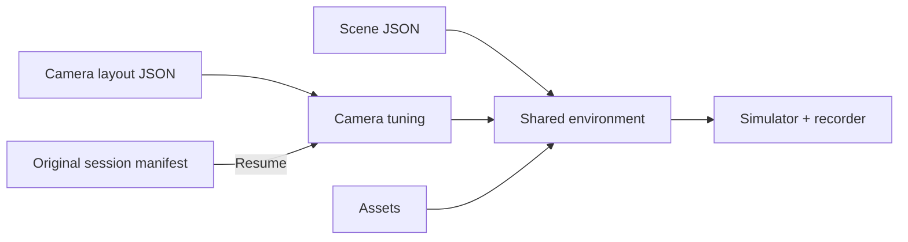

# Environment & cameras

[Overview](../README.md) · [Recorder](../docs/RECORDER.md)

| File | Fungsi |
| --- | --- |
| `scene_layout.json` | Meja, robot, grid, tray, lighting |
| `camera_layout.json` | Pose kamera dan focal length; front aktif |
| `phase4_scene.py` | Scene assembly dan provenance manifest |
| `phase3_shared_env_cfg.py` | Builder Isaac environment; nama legacy masih aktif |
| `phase3_camera_tuning.py` | Resolusi native, FOV dan layout loading |
| `phase3_recorder_camera_patch.py` | Penerapan kamera ke recorder |
| `phase4_camera_names.py` | Mapping nama sensor/public |
| `instrument_preview_geometry.json` | Geometry preview panel |
| `shared_layout.json` | Konfigurasi kompatibilitas |
| `camera_layout_front_tray_candidate.json` | Kandidat historis, bukan layout aktif |

Root JSON aliases adalah hard links pada workspace terorganisasi ini. Jangan edit alias sebagai konfigurasi independen. Jalankan `python scripts/check_structure.py` setelah perubahan layout.

| Perubahan | Aturan |
| --- | --- |
| Resolusi atau framing baru | Sesi baru, restart simulator |
| Resume | Pertahankan konfigurasi dan layout manifest asli |
| Frozen benchmark | Jangan ubah layout saat berjalan |
