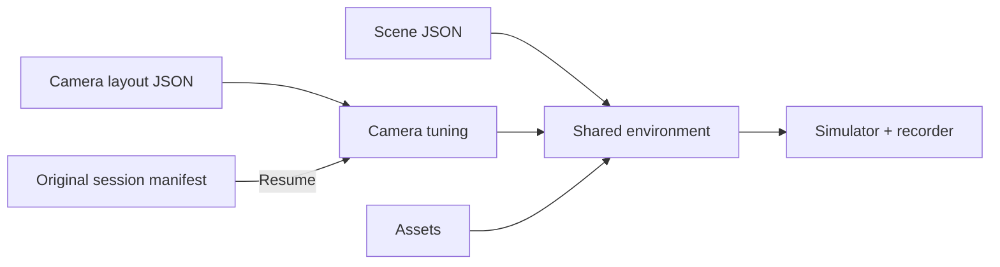

# Environment & cameras

[Overview](../README.md) · [Recorder](../docs/RECORDER.md)

| File | Purpose |
| --- | --- |
| `scene_layout.json` | Table, robot, grid, tray, lighting |
| `camera_layout.json` | Camera poses and focal length; active front view |
| `phase4_scene.py` | Scene assembly and provenance manifest |
| `phase3_shared_env_cfg.py` | Isaac environment builder; the legacy name remains active |
| `phase3_camera_tuning.py` | Native resolution, FOV, layout loading |
| `phase3_recorder_camera_patch.py` | Applying cameras to the recorder |
| `phase4_camera_names.py` | Sensor / public name mapping |
| `instrument_preview_geometry.json` | Panel preview geometry |
| `shared_layout.json` | Compatibility configuration |
| `camera_layout_front_tray_candidate.json` | Historical candidate, not the active layout |

Root JSON aliases are hard links in this organized workspace. Do not treat them as independent configurations.
Run `python scripts/check_structure.py` after layout changes.

| Change | Rule |
| --- | --- |
| New resolution or framing | Start a new session and restart the simulator |
| Resume | Preserve the original configuration and manifest layout |
| Frozen benchmark | Do not change the layout while it is running |
