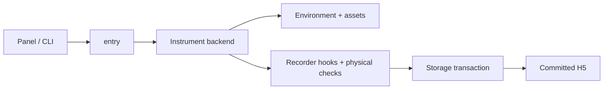

# Source map

[Overview](../README.md) · [Recorder](../docs/RECORDER.md)

| Folder | Tanggung jawab |
| --- | --- |
| `entry/` | Dispatch target instrument, preflight, runner |
| `recorder/` | Reset, spawn, control feedback, coverage, storage, status |
| `ui/` | Panel, geometry preview, log display, commands |

Root modules adalah compatibility shims melalui `_p4_compat.py`, bukan source duplikat yang aman dihapus. Shims menjaga identitas import dan root resource; traceback menunjuk implementasi sebenarnya.

| Boundary | Boleh mengakses |
| --- | --- |
| Expert recorder / QC | Geometry dan state simulator untuk verifikasi |
| Policy input | RGB, robot proprioception, target command operator |
| Training labels | Semantic GT terpisah dari input policy |

Gunakan `python scripts/p4.py panel` atau `python scripts/p4.py record ...` dari root proyek.
