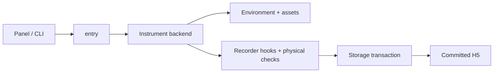

# Source map

[Overview](../README.md) · [Recorder](../docs/RECORDER.md)

| Folder | Responsibility |
| --- | --- |
| `entry/` | Target-instrument dispatch, preflight, runner |
| `recorder/` | Reset, spawn, control feedback, coverage, storage, status |
| `ui/` | Panel, geometry preview, log display, commands |

Root modules are compatibility shims loaded through `_p4_compat.py`, not disposable source duplicates.
Shims preserve import identity and resource roots; tracebacks point to the implementation.

| Boundary | Allowed access |
| --- | --- |
| Expert recorder / QC | Simulator geometry and state for verification |
| Policy inputs | RGB, robot proprioception, operator target command |
| Training labels | Semantic GT, separate from policy inputs |

Run `python scripts/p4.py panel` or `python scripts/p4.py record ...` from the project root.
