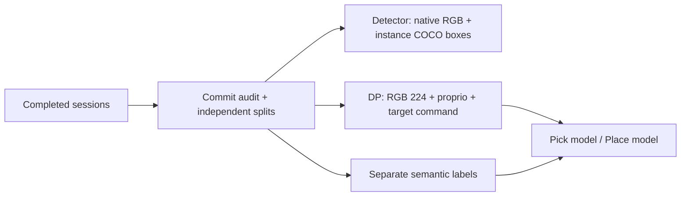
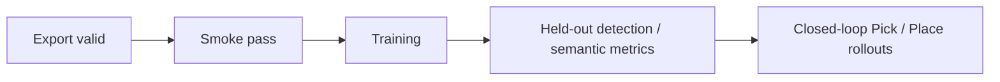

# Training & dataset export

[Overview](../README.md) · [Kontrak detail](../docs/TRAINING_V2.md) · [Inference](../docs/INFERENCE.md)

## Dua jalur dari raw yang sama



| Jalur | Input | Supervision |
| --- | --- | --- |
| Detector terpisah | RGB native | Visible bounding boxes per instance, termasuk duplikat |
| DP + perception | Enam RGB 224, 16-D robot state, target command | Aksi 8-D + semantic head 11 kelas |
| Semantic perception | RGB | Kelas per piksel, bukan instance bounding-box detector |

Pose objek simulator, grid ID, slot target, expert stage, depth dan semantic GT bukan input policy. Semantic GT hanya label; target command berasal dari operator.

## Export koleksi

Dari root proyek, ganti semua placeholder. Source harus berisi sesi train, valid dan test independen. Output harus folder baru **di luar source**.

```powershell
& C:\IsaacLab\_isaac_sim\python.bat training\export_recordings.py `
  --source "<RAW_COLLECTION>" `
  --output "<NEW_EXPORT_DIRECTORY>" `
  --purpose both
```

| Output | Isi |
| --- | --- |
| `detection/` | RGB, anotasi detector dan masks |
| `dp/` | Policy datasets + labels terpisah |
| `export_complete.json` | Penanda export selesai, bukan sertifikat akurasi |

Gunakan `--purpose detection` atau `--purpose dp` untuk satu jalur.
Export detector tidak otomatis melatih YOLO atau model detector lain.

## Smoke test DP

```powershell
& C:\IsaacLab\_isaac_sim\python.bat training\train_sensor_policy.py `
  --dataset "<EXPORT_DIRECTORY>\dp" `
  --output "<NEW_PICK_RUN_DIRECTORY>" `
  --skill pick --steps 3 --batch-size 1 --smoke
```

Ulangi dengan `--skill place` dan output berbeda. Smoke hanya memeriksa eksekusi. Untuk eksperimen training, hilangkan `--smoke` dan tetapkan budget/device.

| Kontrak | Nilai |
| --- | --- |
| Checkpoint input | `p4_sensor_task_v2` |
| Default observation / prediction horizon | 2 / 16 langkah |
| Aksi | `x, y, z, qw, qx, qy, qz, gripper`, frame robot-base |
| Control tick | 0.02 detik |
| Semantic head | 11 kelas; checkpoint 8 kelas lama tidak kompatibel |
| Normalisasi | Statistik train saja |
| Split | Antarsesi; pasangan Pick/Place tidak dipisah antar-split |

## Bukti yang diperlukan



Belum ada klaim siap deployment. Periksa detail visual **input akhir 224**, bukan hanya raw 448. Bukti baseline historis bukan status training terbaru.

[Data lokal](datasets/README.md) · [Debug](../debug/README.md)
