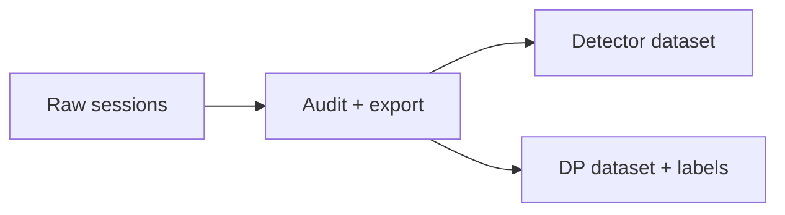

# Local exported datasets

[Training](../README.md)

| Simpan bersama dataset | Tujuan |
| --- | --- |
| Manifest export | Kontrak, provenance, completion |
| Source checksums | Pelacakan rekaman asli |
| Train / valid / test assignments | Mencegah kebocoran antarsplit |
| Konfigurasi kamera dan policy | Reproduksibilitas |

Output dataset diabaikan oleh Git. Jangan campur cohort dengan kalibrasi atau kontrak berbeda tanpa migrasi eksplisit.
