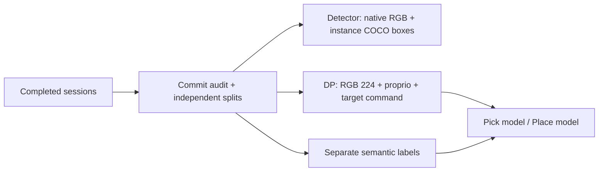
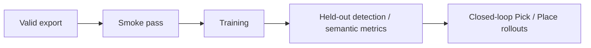

# Training & dataset export

[Overview](../README.md) · [Detailed contract](../docs/TRAINING_V2.md) · [Inference](../docs/INFERENCE.md)

## Two paths from the same raw data



| Path | Input | Supervision |
| --- | --- | --- |
| Standalone detector | Native RGB | Visible bounding boxes per instance, including duplicates |
| DP + perception | Six RGB 224 views, 16-D robot state, target command | 8-D actions + an 11-class semantic head |
| Semantic perception | RGB | Per-pixel classes, not an instance bounding-box detector |

Simulator object poses, grid IDs, target slots, expert stages, depth, and semantic GT are not policy inputs.
Semantic GT is supervision only; the target command comes from the operator.

## Export a collection

Run from the project root and replace every placeholder. The source must contain independent train, validation, and test sessions. The output must be a new folder **outside the source**.

```powershell
& C:\IsaacLab\_isaac_sim\python.bat training\export_recordings.py `
  --source "<RAW_COLLECTION>" `
  --output "<NEW_EXPORT_DIRECTORY>" `
  --purpose both
```

| Output | Contents |
| --- | --- |
| `detection/` | RGB, detector annotations, and masks |
| `dp/` | Policy datasets and separate labels |
| `export_complete.json` | Export completion marker, not an accuracy certificate |

Use `--purpose detection` or `--purpose dp` for a single path.
Detector export does not automatically train YOLO or any other detector.

## DP smoke test

```powershell
& C:\IsaacLab\_isaac_sim\python.bat training\train_sensor_policy.py `
  --dataset "<EXPORT_DIRECTORY>\dp" `
  --output "<NEW_PICK_RUN_DIRECTORY>" `
  --skill pick --steps 3 --batch-size 1 --smoke
```

Repeat with `--skill place` and a different output folder. Smoke tests check execution only.
For training experiments, remove `--smoke` and set the budget and device.

| Contract | Value |
| --- | --- |
| Checkpoint input | `p4_sensor_task_v2` |
| Default observation / prediction horizon | 2 / 16 steps |
| Action | `x, y, z, qw, qx, qy, qz, gripper`, in the robot-base frame |
| Control tick | 0.02 seconds |
| Semantic head | 11 classes; older 8-class checkpoints are incompatible |
| Normalization | Training-split statistics only |
| Split | By session; paired Pick/Place segments stay in the same split |

## Required evidence



Deployment readiness has not been established. Inspect detail in the **final 224 input**, not just raw 448 images.
Historical baseline evidence does not describe the latest training status.

[Local data](datasets/README.md) · [Debug](../debug/README.md)
