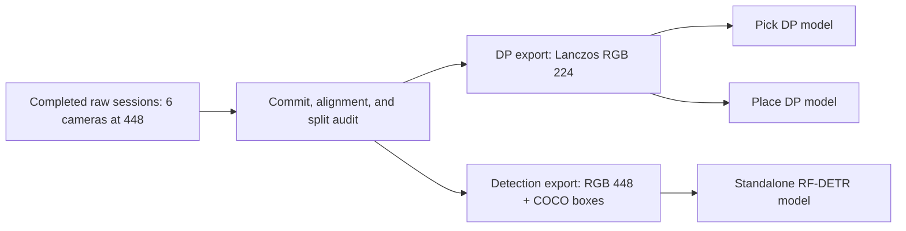
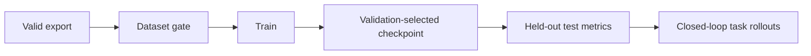

# Training and dataset export

[Overview](../README.md) | [Detailed contract](../docs/TRAINING_V2.md) | [Inference](../docs/INFERENCE.md)

## One recording, two separate models

Choose **Both: DP + detector** and **448** in the recorder panel.



| Product | Training input | Result |
| --- | --- | --- |
| Diffusion Policy | Six RGB views resized to 224, 16-D robot state, target command | Separate Pick and Place policies |
| RF-DETR | Six native 448 RGB views and visible per-instance boxes | Reusable five-class detector |
| Semantic supervision | Eleven-class masks aligned to every camera | DP perception auxiliary target; not RF-DETR input |

RF-DETR and DP are trained separately. Replacing DP with OpenVLA later does not require retraining the standalone detector unless the detector's camera domain or classes change.

## 1. Export after collection

The raw collection must contain complete, independently recorded `train`, `valid`, and `test` sessions. Frames from one session are never randomly divided across splits.

```powershell
cd "<PROJECT_DIRECTORY>"
.\RUNME.ps1 -Mode export `
  -Source "<RAW_COLLECTION>" `
  -Output "<NEW_EXPORT_DIRECTORY>"
```

| Output | Contents |
| --- | --- |
| `<NEW_EXPORT_DIRECTORY>\detection` | Native 448 PNG, masks, instance maps, COCO boxes, RF-DETR annotation files |
| `<NEW_EXPORT_DIRECTORY>\dp` | RGB 224, state, target command, actions, semantic labels |
| `<NEW_EXPORT_DIRECTORY>\export_complete.json` | Export completion marker, not an accuracy certificate |

Every detection split contains `_annotations.coco.json`, the filename RF-DETR uses to recognize a Roboflow-style COCO dataset. Its `file_name` entries point to the existing `images/` folder; image bytes are not duplicated.

## 2. Install RF-DETR once

Use a separate environment instead of modifying Isaac Sim's Python dependencies.

```powershell
.\RUNME.ps1 -Mode rfdetr-setup
```

This creates `.venv-rfdetr` with Python 3.11 and the pinned training package in `training/rfdetr/requirements.txt`. A CUDA-compatible PyTorch installation and GPU are strongly recommended for actual training.

## 3. Gate the detector dataset

```powershell
.\RUNME.ps1 -Mode rfdetr-check `
  -Dataset "<NEW_EXPORT_DIRECTORY>\detection"
```

The gate fails before training if any split is missing or empty, images are not native 448, a class has no visible instance in a split, IDs are invalid, boxes leave the image, files are missing, or the export/split contract is unsafe.

## 4. Train and test RF-DETR

```powershell
.\RUNME.ps1 -Mode rfdetr-train `
  -Dataset "<NEW_EXPORT_DIRECTORY>\detection" `
  -Output "<NEW_RFDETR_RUN_DIRECTORY>" `
  -RFDetrModel small `
  -Epochs 50 `
  -BatchSize 4 `
  -GradAccumSteps 4
```

| Setting | Recommended start | Change when |
| --- | --- | --- |
| Model | `small` | Use `nano` for lower VRAM/latency; larger variants cost more memory |
| Batch size | `4` | Reduce to `2` or `1` on out-of-memory |
| Gradient accumulation | `4` | Increase when batch size is reduced |
| Epochs | `50` | Tune from validation curves; do not select using test metrics |

The 448 setting is the stored source resolution. RF-DETR applies the selected model variant's own training resolution internally; it does not require destructive pre-cropping of the exported images.

Training uses `dataset_file=roboflow`, which remaps the COCO category IDs `1..5` to the contiguous RF-DETR label space. After training, the wrapper evaluates the explicit `test/` split and writes:

| Artifact | Meaning |
| --- | --- |
| `checkpoint_best_total.pth` | Best validation-selected checkpoint |
| `training_config.json` | RF-DETR run configuration |
| `p4_rfdetr_result.json` | P4 dataset audit plus held-out test mAP, mAR, and F1 metrics |

## 5. Train DP separately

First run a smoke test for each skill:

```powershell
.\RUNME.ps1 -Mode train-smoke -Dataset "<NEW_EXPORT_DIRECTORY>\dp" -Skill pick
.\RUNME.ps1 -Mode train-smoke -Dataset "<NEW_EXPORT_DIRECTORY>\dp" -Skill place
```

Smoke tests prove only that the computation path executes. Full experiments use `training/train_sensor_policy.py` with a new output directory and the intended step budget.

| DP contract | Value |
| --- | --- |
| Checkpoint input | `p4_sensor_task_v2` |
| Observation / prediction horizon | 2 / 16 steps by default |
| Action | `x, y, z, qw, qx, qy, qz, gripper` in robot-base frame |
| Control tick | 0.02 seconds |
| Semantic head | 11 classes |
| Normalization | Training-split statistics only |

## Readiness boundary



Passing the export and RF-DETR gate means the files are structurally safe to start training. It does not guarantee accuracy, class balance, real-camera transfer, or manipulation success; those require metric review and closed-loop evaluation.

[Local data](datasets/README.md) | [Debug](../debug/README.md)
