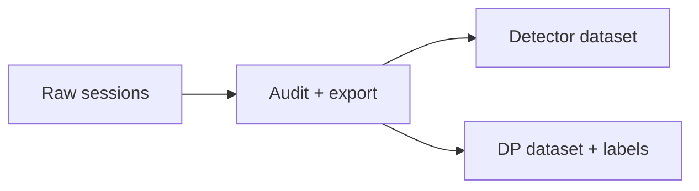

# Local exported datasets

[Training](../README.md)

| Keep alongside each dataset | Purpose |
| --- | --- |
| Export manifest | Contract, provenance, completion |
| Source checksums | Traceability to raw recordings |
| Train / validation / test assignments | Prevent split leakage |
| Camera and policy configuration | Reproducibility |

Dataset output is ignored by Git. Do not mix cohorts with different calibration or contracts without explicit migration.
