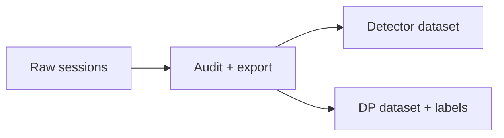

# Local exported datasets

[Training](../README.md)



| Keep alongside each dataset | Purpose |
| --- | --- |
| Export manifest | Contract, provenance, completion |
| Source checksums | Traceability to raw recordings |
| Train / validation / test assignments | Prevent split leakage |
| Camera and policy configuration | Reproducibility |

RF-DETR detector exports use this layout:

```text
detection/
|-- manifest.json
|-- train/_annotations.coco.json
|-- train/images/*.png
|-- valid/_annotations.coco.json
|-- valid/images/*.png
|-- test/_annotations.coco.json
`-- test/images/*.png
```

Pass the `detection` directory itself to `RUNME.ps1 -Mode rfdetr-check` or
`rfdetr-train`, not the combined export directory.

Dataset output is ignored by Git. Do not mix cohorts with different calibration or contracts without explicit migration.
